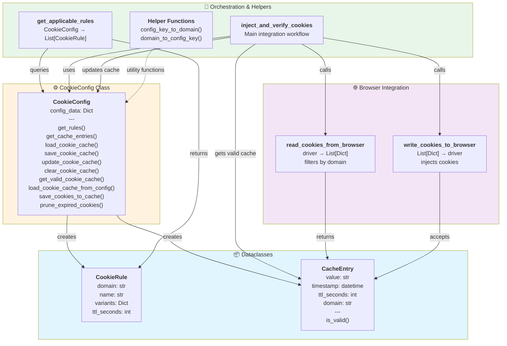

```mermaid
graph TB
    subgraph Dataclasses["📦 Dataclasses"]
        CookieRule["<b>CookieRule</b><br/>domain: str<br/>name: str<br/>variants: Dict<br/>ttl_seconds: int"]
        CacheEntry["<b>CacheEntry</b><br/>value: str<br/>timestamp: datetime<br/>ttl_seconds: int<br/>domain: str<br/>---<br/>is_valid()"]
    end

    subgraph CookieConfigClass["⚙️ CookieConfig Class"]
        CC["<b>CookieConfig</b><br/>config_data: Dict<br/>---<br/>get_rules()<br/>get_cache_entries()<br/>load_cookie_cache()<br/>save_cookie_cache()<br/>update_cookie_cache()<br/>clear_cookie_cache()<br/>get_valid_cookie_cache()<br/>load_cookie_cache_from_config()<br/>save_cookies_to_cache()<br/>prune_expired_cookies()"]
    end

    subgraph BrowserIntegration["🌐 Browser Integration"]
        ReadCookies["<b>read_cookies_from_browser</b><br/>driver → List[Dict]<br/>filters by domain"]
        WriteCookies["<b>write_cookies_to_browser</b><br/>List[Dict] → driver<br/>injects cookies"]
    end

    subgraph Orchestration["🔗 Orchestration & Helpers"]
        GetApplicable["<b>get_applicable_rules</b><br/>CookieConfig → List[CookieRule]"]
        InjectVerify["<b>inject_and_verify_cookies</b><br/>Main integration workflow"]
        HelperFuncs["<b>Helper Functions</b><br/>config_key_to_domain()<br/>domain_to_config_key()"]
    end

    %% Relationships
    CC -->|creates| CookieRule
    CC -->|creates| CacheEntry
    GetApplicable -->|queries| CC
    GetApplicable -->|returns| CookieRule
    
    InjectVerify -->|uses| CC
    InjectVerify -->|calls| ReadCookies
    InjectVerify -->|calls| WriteCookies
    InjectVerify -->|gets valid cache| CacheEntry
    InjectVerify -->|updates cache| CC
    
    ReadCookies -->|returns| CacheEntry
    WriteCookies -->|accepts| CacheEntry
    
    HelperFuncs -.->|utility functions| CC
    
    style Dataclasses fill:#e1f5ff
    style CookieConfigClass fill:#fff3e0
    style BrowserIntegration fill:#f3e5f5
    style Orchestration fill:#e8f5e9
```